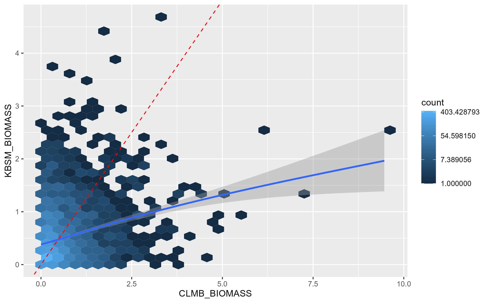
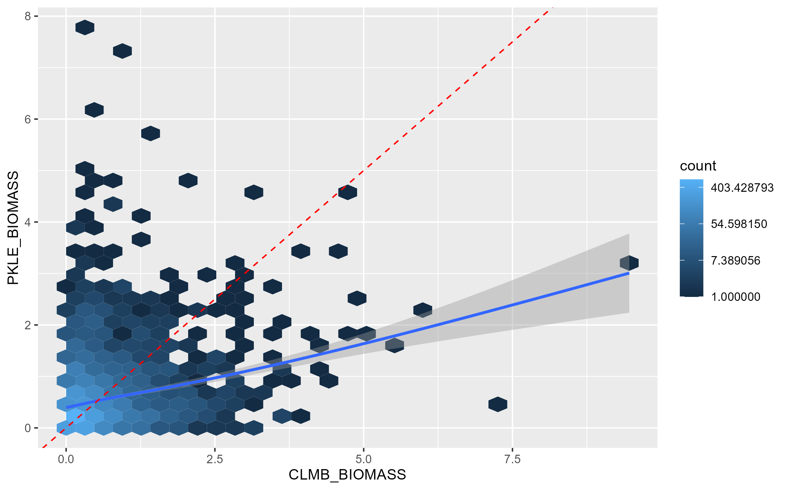
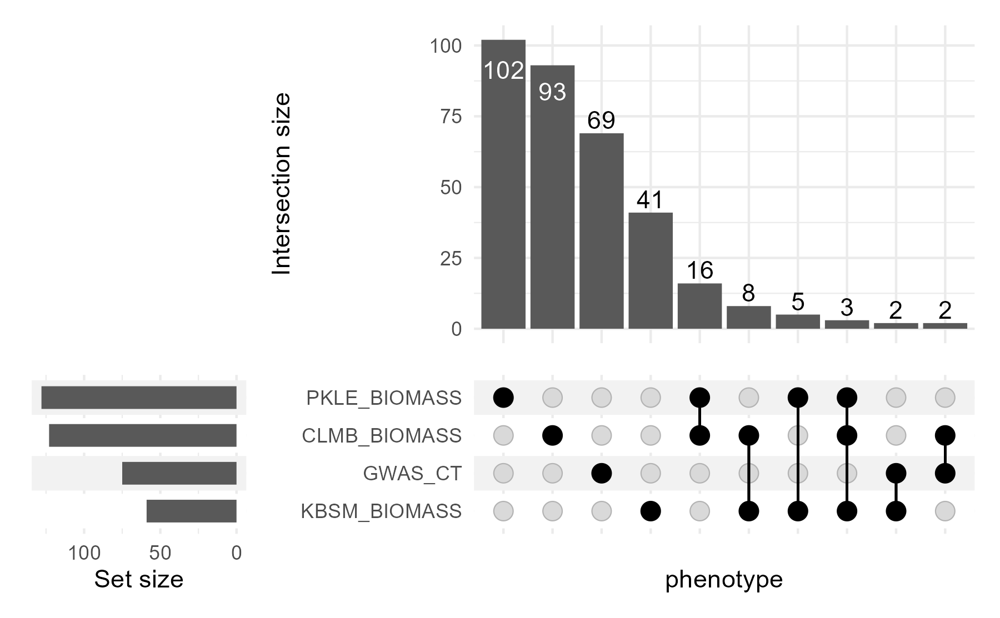

```{r, include = FALSE}
knitr::opts_chunk$set(
  collapse = TRUE,
  comment = "#>",
  fig.path = "man/figures/gwas-",
  fig.width = 6,
  fig.asp = 0.618,
  out.width = "70%",
  fig.align = "center"
)
library(knitr)
```

When you run GWAS using this package, you now have two options for saving the GWAS results - as RDS files and as file-backed matrix (FBM) files.

You can specify this option in `pvdiv_standard_gwas()` with the option `savetype`. `savetype` can be "rds", "fbm", or "both".

## Why use RDS files?

If you are running few GWAS and want to save each GWAS output separately, you can use rds files. These files completely describe the GWAS results without referring back to the original SNP file, using the columns CHR (chromosome) & POS (physical position). They contain the effect estimate `estim` for the alternate allele (allele 2 in the SNP file), the standard error around this effect `std_err`, and the -log10pvalue and FDR adjusted p-values `log10p` and `FDR_adj` from the genome-wide association.

### Pros of RDS files

These files are standalone & contain all the information you need to analyze a GWAS result.

These rds files can be used with the function pvdiv_bigsnp2mashr to run mash, as well as with pvdiv_table_topsnps (by specifying type = "bigsnp"), pvdiv_qqplot, and pvdiv_manhattan.

### Cons of RDS files
If you are running many GWAS, these files can become numerous, take up substantial disk space, and become hard to keep track of. Individual files make it more difficult to compare results across multiple GWAS.


## Why use FBM files?

If you are running many GWAS, you may want a compressed format, a reduced number of files, and/or additional ways to compare GWAS outputs. To do this, you can use FBM files, which save all GWAS results in a total of 4 files. These files all start with the prefix 'gwas_effects_'. Two are .csv files; these contain the associated metadata for the GWAS and the column names for the fbm. Two are an .rds & .bk format & contain the actual file-backed matrix results; these can be very large. 

For each phenotype used for GWAS, the gwas_effects files contain the effect estimate `estim` for the alternate allele (allele 2 in the SNP file), the standard error around this effect `std_err`, and the -log10pvalue `log10p`  from the genome-wide association. 

### Pros of FBM files
FBM files are memory and computation-efficient tools to analyze big matrices that are stored on disc rather than in your computer's memory ([see here for more details](https://privefl.github.io/R-presentation/bigstatsr.html#2) ). Briefly, they have faster I/O, won't overwhelm your computer's RAM, and function runtime speeds up ~10-200x.

These fbm files can be used with the functions pvdiv_fbm_upset_df() and pvdiv_fbm_qq(). They can also be used in the snpdiver R package function dive_effects2mash() to run mash.

### Cons of FBM files

These files need to be used along with the original snp file used to run the GWAS - thus, you'll need to keep track of six files in total, the .rds and .bk file for the SNP file and the four files for the gwas results. 

These files do not work with the function pvdiv_bigsnp2mashr to run mash. 

If you are interested in only a subset of GWAS results saved in a fbm, you will have to create a vector of row numbers using the associated metadata to refer to that data subset.

# Using FBM gwas results

The remainder of this package demonstrates some utilities for filebacked matrix files within the bigsnpr and switchgrassGWAS R packages.


## Get genotype file
```{r}
# get the example bedfile from the package switchgrassGWAS
bedfile <- system.file("extdata", "example.bed", package = "switchgrassGWAS")
```

## Set up SNP and phenotype data frames.
```{r setup}
# Load packages bigsnpr and switchgrassGWAS
library(switchgrassGWAS)
library(bigsnpr)

# Read from bed/bim/fam to create the new files that bigsnpr uses.
# Let's put them in an temporary directory for this demo.
tmpfile <- tempfile()
snp_readBed(bedfile, backingfile = tmpfile)

# Attach the "bigSNP" object to the R session.
snp_example <- snp_attach(paste0(tmpfile, ".rds"))
# What does the bigSNP object look like?
str(snp_example, max.level = 2, strict.width = "cut")

# Load the pvdiv phenotypes into the R session.
data(pvdiv_phenotypes) 
# Make an example dataframe of one phenotype where the first column is PLANT_ID.
# This "phenotype", 'GWAS_CT', is the number of times a plant successfully 
# clonally replicated to plant in the common gardens in 2018.
four_phenotype <- pvdiv_phenotypes %>%
  dplyr::select(PLANT_ID, GWAS_CT, matches("BIOMASS"))
```

## Run genome-wide association (GWAS)
```{r}
# Save the output to a temporary directory for this demo.
tempdir <- tempdir()

pvdiv_standard_gwas(snp = snp_example, df = four_phenotype, 
                    type = "linear", outputdir = tempdir, 
                    savegwas = TRUE, savetype = "fbm", 
                    saveplots = FALSE,
                    saveannos = FALSE, ncores = 1)
```
This command will save a set of gwas results to a temporary directory, which will have a randomly generated name like: `r tempdir`.

Let's load these files into R.
```{r}
gwas <- big_attach(file.path(tempdir, "gwas_effects_0M_SNPs.rds"))
gwas_metadata <- read.csv(file.path(tempdir, "gwas_effects_0M_SNPs_associated_metadata.csv"))
gwas_colnames <- read.csv(file.path(tempdir, "gwas_effects_0M_SNPs_column_names.csv"))
```

Let's look at the metadata associated with the GWAS. This includes information about the kind of GWAS that was conducted. In order, the columns indicate, what the phenotype name was, what type of model was run, how many SNPs (in M) were used, how many PCs were used for population structure correction, how many phenotyped individuals were there, how many phenotypic levels were there, what was the genomic inflation factor (lambda_GC), and given the number of SNPs, what was the bonferroni threshold for the phenotype.
```{r}
kable(gwas_metadata)
```

Let's look at the column names of the GWAS result. These are in the same order as the associated metadata, and each phenotype has three columns: Effect (estimated effect size of allele2), SE (standard error about this effect size), and log10p (-log10p of the association between SNP & phenotype).
```{r}
kable(gwas_colnames)
```

## Two-GWAS Comparisons
Let's analyze overlaps in significance in the four GWAS. Is there a relationship between the -log10pvalues in the three BIOMASS GWAS? If so, this could indicate that SNPs have a similar effect on BIOMASS across the three different environments.

Use the row numbers from the associated metadata to compare -log10p values for row 2 (CLMB_BIOMASS) with rows 3 & 4 (biomass at KBSM & PKLE). Set the threshold above which to plot the p-value at zero (default is 5), because there are not many SNPs in this toy example.
```{r}
pvdiv_fbm_qq(effects = gwas, metadata = gwas_metadata, e_row = 2, o_row = 3:4, 
             outputdir = tempdir, thr = 0)
```

This function will again save plots to the tempdir. These plots should look like this:

{ width=50% }

and this:

{ width=50% }

If these GWAS results were perfectly related, all the hexagons would fall on the red dashed 1:1 line. The blue line indicates the actual relationship between the p-values in the two GWAS. We can see that there is a modest positive relationship between biomass in these environments, but it's by no means strong. This indicates the presence of genotype-by-environment interactions between these environments.

## Upset plots

Now, let's compare results for more than one GWAS. The way I recommend doing this is with an [Upset plot](https://upset.app/). Upset plots are well suited to the quantitative analysis of data when there are more than three sets. They shine when you want to look at all combinations of how sets interact - for example, when you're interested in sets of SNPs significant in different combinations of GWAS.

Here's some great documentation on [how to code an Upset plot in R](https://krassowski.github.io/complex-upset/articles/Examples_R.html). 

Let's make a dataframe to go into an Upset plot and visualize it in R.

There are three required arguments: 
    
  * the first argument is expected to be the gwas results fbm
  * the second argument is expected to be the snp fbm used to generate the gwas results
  * the third argument is expected to be the metadata associated with the GWAS results.
    
We can also optionally specify a -log10p threshold with 'thr'. By default, that threshold is 7. A good target is to set this above the noise floor for all of the GWAS you are comparing. For our toy example, we set this artificially low, to 2.
```{r}
upset_df <- pvdiv_fbm_upset_df(effects = gwas, snp = snp_example, 
                               metadata = gwas_metadata, thr = 2)
upset_df
```
This dataframe has CHR & POS from the SNP file, and then an additional column for each phenotype. If that SNP is not significant at the -log10p value threshold for that phenotype (here, `thr = 2`), then that row & column combination will have a '0'. If that SNP is significant for the phenotype, that value will be '1'.

Now, let's make an upset plot using the R package ComplexUpset.

There are two required arguments:

  * the first argument is expected to be a dataframe with both group indicator variables and covariates,
  * the second argument specifies a list with names of column which indicate the group membership.

``` r
library(ComplexUpset)
upset_plot <- upset(upset_df, intersect = colnames(upset_df)[-(1:2)], 
                    name = 'phenotype', min_size = 2)
upset_plot                    
```

{ width=50% }
In this Upset plot, we can see that there are many more SNPs significant in one or more biomass phenotype than there are significant for the phenotype 'GWAS_CT' and any biomass phenotype. Though, overall, most SNPs are significant in only one of the four conditions.

Sometimes this could be because different SNPs in the same gene or genomic region are coming up as highly associated with the different phenotypes. To test this, we can summarize our upset_df slightly based on position, and make a new Upset plot.

Median LD in switchgrass is between 20 and 25kb. Normally this is the largest genomic region I would make. However, for this toy example, we'll make larger genomic regions of 1Mb.

```{r}
library(dplyr)

upset_df_1Mb <- upset_df %>%
  mutate(POS_binned = floor(POS/1000000)*1000000) %>%
  select(-POS) %>%
  select(CHR, POS_binned, everything()) %>%
  group_by(CHR, POS_binned) %>%
  summarise(across(everything(), ~ max(.x)))
```
``` r
upset_1Mb <- upset(upset_df_1Mb, intersect = colnames(upset_df_1Mb)[-(1:2)], 
                    name = 'phenotype', min_size = 2) + 
  labs(title = "Significant at -log10p > 2 in 1Mb intervals")
upset_1Mb  
```
{ width=50% }
This binning by genomic interval does result in more genomic regions with significant effects on multiple phenotypes. It doesn't change the ordering of the kinds of intersections very much, with the exception that the three-way intersection between the three biomass phenotypes is now the least common intersection (with 4 1Mb regions containing significant associations for all three phenotypes).

What if we want to learn more about these 4 1Mb regions? We can go back to our upset dataframes to extract these regions.
```{r}
sel_reg_biomass <- upset_df_1Mb %>%
  filter(across(CLMB_BIOMASS:PKLE_BIOMASS, ~ .x == 1)) %>%
  mutate(Sel_region = paste(CHR, POS_binned, sep = "_"))

sel_snp_biomass <- upset_df %>%
  mutate(POS_binned = floor(POS/1000000)*1000000,
         Sel_region = paste(CHR, POS_binned, sep = "_")) %>%
  filter(Sel_region %in% sel_reg_biomass$Sel_region)

kable(sel_snp_biomass)
```

If we were interested enough in these regions, we could also use this table to find annotations using `pvdiv_table_topsnps()`.
``` r
sel_snp_annos <- sel_snp_biomass %>%
  mutate(start = POS - 10000,
         end = POS + 10000)  # get the 20kb surrounding each position, POS, in thr_dfB

library(AnnotationDbi)
library(VariantAnnotation)
txdb <- loadDb(file = "../../pvdiv-genome/Pvirgatum_516_v5.1.gene.txdb.sqlite")

sel_snp_annos <- pvdiv_table_topsnps(df = sel_snp_annos, type = "table", txdb = txdb)
```
```{r, include = FALSE}
anno_file <- system.file("extdata", "Annotation_tables_3_BIOMASS.rds", 
                         package = "switchgrassGWAS")
anno_tables <- readRDS(anno_file)
```

```{r}

kable(anno_tables)
```

