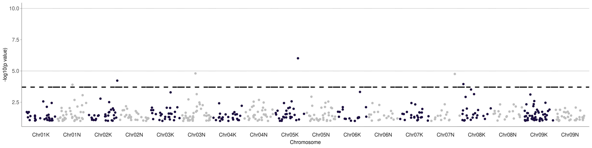
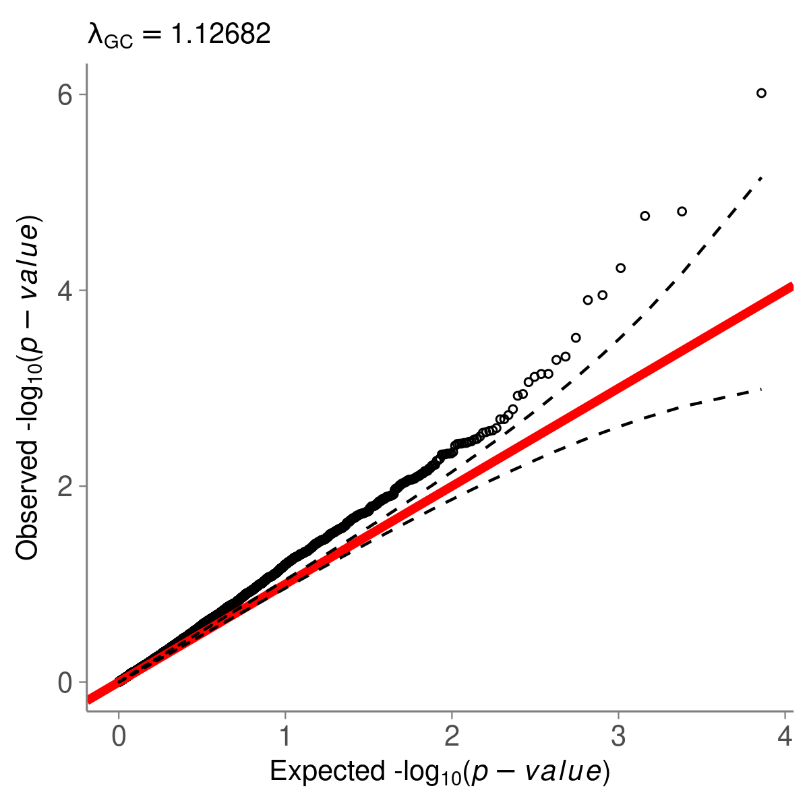

```{r, include = FALSE}
knitr::opts_chunk$set(
  collapse = TRUE,
  comment = "#>",
  fig.path = "man/figures/gwas-",
  fig.width = 6,
  fig.asp = 0.618,
  out.width = "70%",
  fig.align = "center"
)
```

## Get genotype file
```{r}
# get the example bedfile from the package switchgrassGWAS
bedfile <- system.file("extdata", "example.bed", package = "switchgrassGWAS")
```

## Set up SNP and phenotype data frames.
```{r setup}
# Load packages bigsnpr and switchgrassGWAS
library(switchgrassGWAS)
library(bigsnpr)

# Read from bed/bim/fam to create the new files that bigsnpr uses.
# Let's put them in an temporary directory for this demo.
tmpfile <- tempfile()
snp_readBed(bedfile, backingfile = tmpfile)

# Attach the "bigSNP" object to the R session.
snp_example <- snp_attach(paste0(tmpfile, ".rds"))
# What does the bigSNP object look like?
str(snp_example, max.level = 2, strict.width = "cut")

# Load the pvdiv phenotypes into the R session.
data(phenotypes) 
# Make an example dataframe of one phenotype where the first column is PLANT_ID.
# This "phenotype", 'GWAS_CT', is the number of times a plant successfully 
# clonally replicated to plant in the common gardens in 2018.
one_phenotype <- phenotypes %>%
  dplyr::select(PLANT_ID, GWAS_CT)
```

## Run genome-wide association (GWAS)
```{r}
# Save the output to a temporary directory for this demo.
tempdir <- tempdir()

pvdiv_standard_gwas(snp = snp_example, df = one_phenotype, 
                    type = "linear", outputdir = tempdir, 
                    savegwas = FALSE, saveplots = TRUE,
                    saveannos = FALSE, ncores = 1)
```
This command will save a Manhattan and QQ-plot for the ~1800 SNPs from the example file to a temporary directory, `r tempdir`.

The example Manhattan plot should look like this: 

{ width=100% }


And the example QQ plot should look like this. 

{ width=50% }

`pvdiv_standard_gwas` is a wrapper function for the standard GWAS done in the Juenger lab. You must specify three things to use this function: 1) a snp file in bigSNP format, 2) a phenotype file where the first column is PLANT_ID (as in `switchgrassGWAS::pvdiv_metadata`), and 3) whether the GWAS should be a linear or logistic regression. 

### Additional features:

    * Specify `savegwas = TRUE` if you want the GWAS outputs to be saved to the output directory as .rds files.
    * Specify `saveplots = TRUE` if you want Manhattan and QQ-plots to be generated and saved to the output directory. (NB: This is the default.)
    * Specify `saveannos = TRUE` and specify a txdb object loaded into your environment with AnnotationDbi::loadDb, if you want annotation tables for top SNPs to be generated and saved to the output directory.
    * Specify an integer value for `minphe` if you want to specify a minimum number of phenotyped individuals to conduct a GWAS on. 
